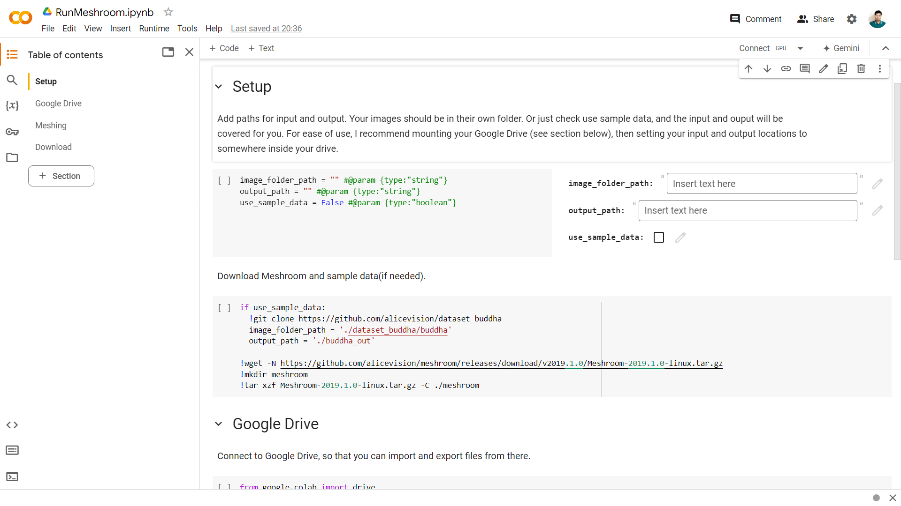
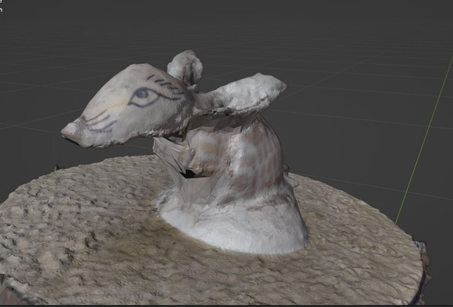
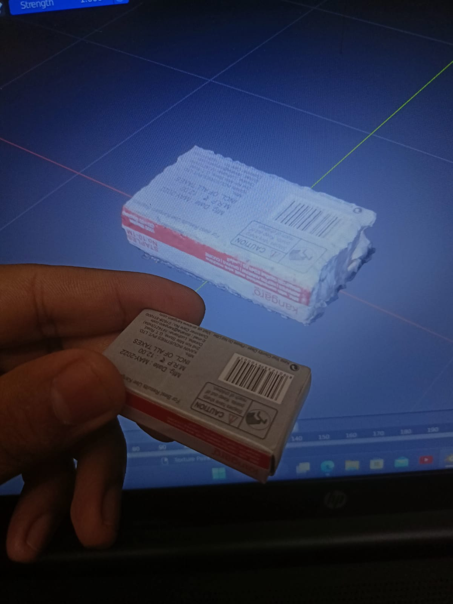

# 3D-Cam-Scanner

## Overview
**3D Cam Scanner** is an advanced tool that enables users to scan objects and convert them into 3D models using a any camera. It combines cutting-edge computer vision techniques with real-time image processing and photogrammetry techniques to create accurate 3D representations of physical objects.

## Features
- Capture real-world objects and convert them into 3D models.
- Real-time processing with visual feedback.
- Export 3D models in common file formats (e.g., OBJ, STL).
- Easy-to-use interface with user-friendly controls.
- Support for various camera angles and multiple lighting conditions.

## Screenshots

Caption: This is the Google Colab interface used to run the meshroom jupyter notebook which process the captured images to 3D Model.

Caption: This is the real model that is used to test the project.

Caption: This is the 3D model of that real model formed by the meshroom jupyter notebook.

Caption: This is the real time comparison of the real object and the 3D model.
